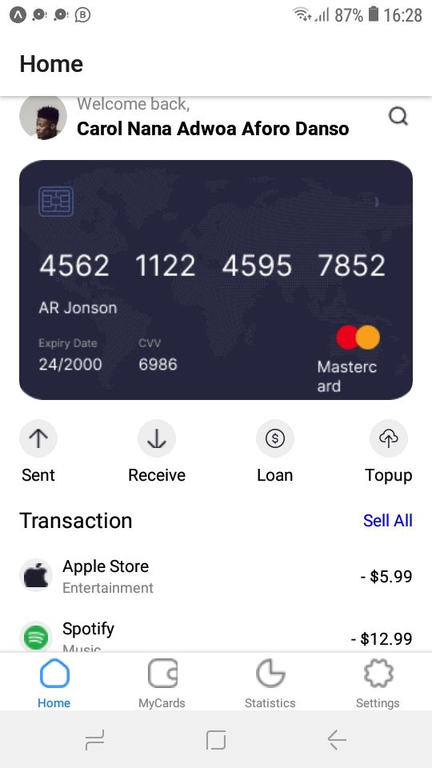
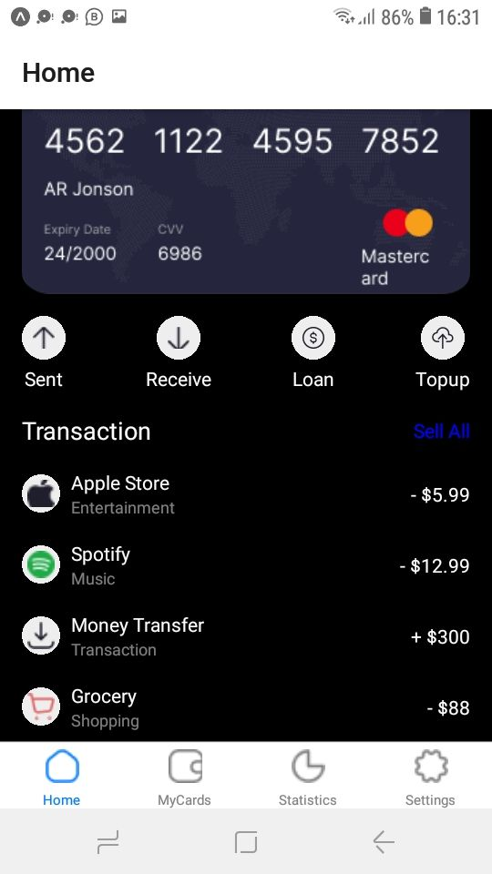
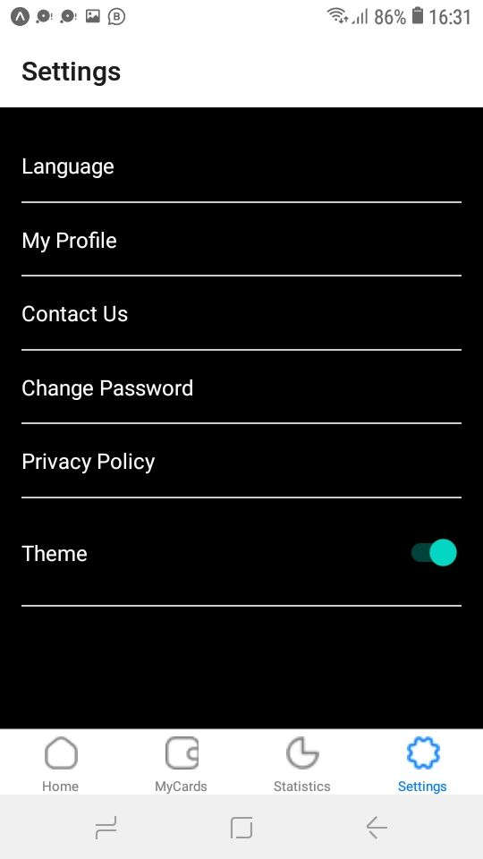

My Expo React Native App
Description
This is a simple mobile application built using React Native and Expo. The app consists of two main screens: the Home Screen and the Settings Screen. The Home Screen displays an image of the card being used for transactions and a list of transactions made. The app includes tab navigation for easy switching between screens and a toggle switch to switch between light and dark theme modes.

Features
Home Screen: Displays an image of the card and a list of transactions.
Settings Screen: Allows users to toggle between light and dark theme modes.
Tab Navigation: Enables easy navigation between the Home Screen and Settings Screen.
Theme Toggle: Users can switch between light and dark themes.
Installation
To get started with this project, follow these steps:

Clone the repository from GitHub.
Navigate to the project directory.
Install the necessary dependencies using npm.
Start the Expo development server.
Usage
Home Screen:

Displays an image of the card being used for transactions.
Lists all the transactions made with the card.
Settings Screen:

Contains a toggle switch to change the theme between light and dark modes.
The selected theme is applied to the entire app.
Tab Navigation:

Use the tab navigation at the bottom of the screen to switch between the Home Screen and Settings Screen.
Project Structure
App.js: The main entry point of the application.
HomeScreen.js: The component for the Home Screen.
SettingsScreen.js: The component for the Settings Screen.
navigation/: Contains the navigation setup for the app.
assets/: Contains images and other assets.
Contributing
If you would like to contribute to this project, please follow these steps:

[text](assets/sreenshot2.jpg)
 
 

Fork the repository.
Create a new branch with a descriptive name.
Make your changes and commit them.
Push your changes to your fork.
Open a pull request to the main repository.
License
This project is licensed under the MIT License. See the LICENSE file for more information.

Acknowledgments
Special thanks to the React Native and Expo communities for their amazing tools and documentation.
